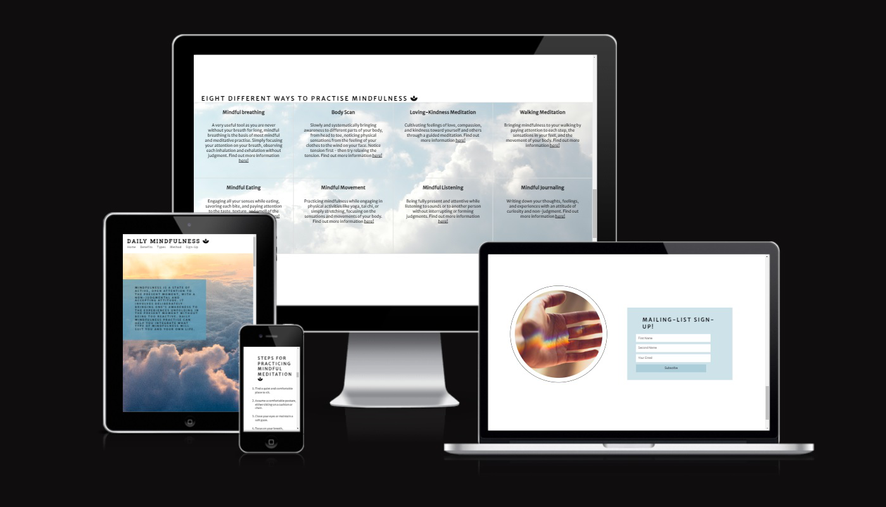
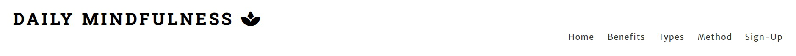
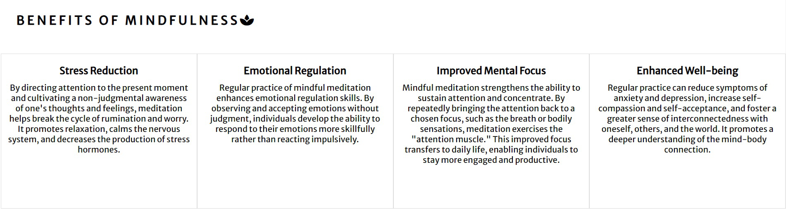
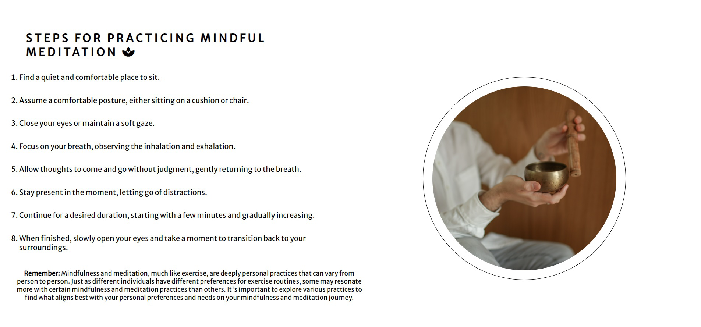
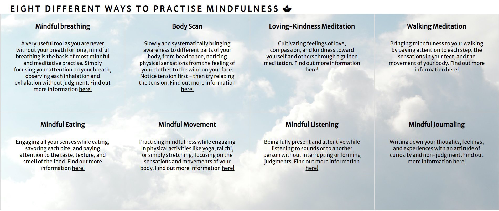
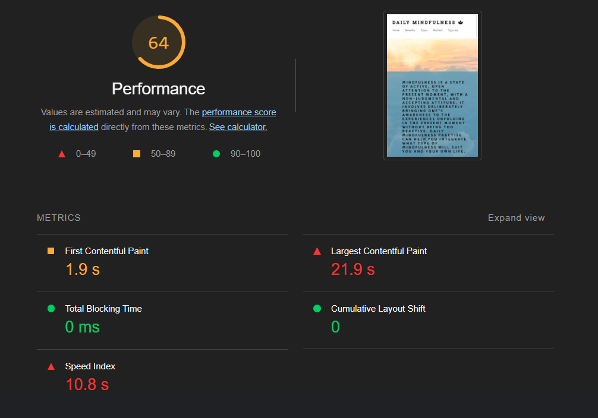
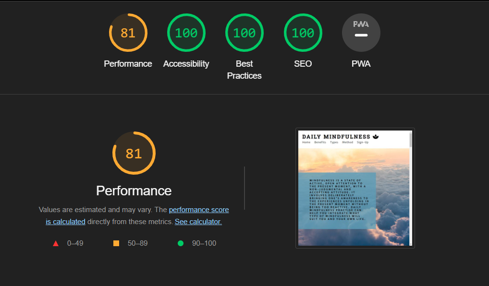

***Daily Mindfulness*** is a website to serve as a basic introduction to mindfulness and mindful meditation with no target demographic. The site firstly provides a definition of the concept of mindfulness alongside its benefits, its method and a simple mindfulness mediation to practise. 

The website also offers a sign-up page for a newsletter for the user to keep updated. The website offers links to external videos to show examples and social media links.

The site is targeted to anybody who wants to learn about mindfulness and reinforces how to integrate it into life recognising mindful meditation as a habit that needs to be practised daily. It is targeted to anybody interested. 

Features
========

Header & Navigation
-------------------

- Logo to the right linked to the top of the page
- Menu with links to home and each of the four pages: home, benefits, types and sign-up.
- The header contains the logo and name of the page. The logo links to the homepage. The black front on white background for me suggests a simplicity that reflects the practise of mindfulness. 
- The navigation links to the side links to the rest of the page for quick access. 
- This section serves as a basic introduction to the website. 
- In response to smaller screen sizes, the navigation menu falls below the logo. Both the logo and the menu then decrease in size incrementally.

Section 1
---------

  - The image chosen to fill the screen in the first page is an image of a cloud: a familiar sight but with mindful practise hopefully our attention can be brought more clearly to this natural phenomenon. 
  - The text in contained inside the box in the middle of the image provides a basic definition of mindfulness and an basic description of the websites function.
  - The box has a colour of opaque light blue which appears darker due to the background image.
  - In response to smaller screen sizes, the box containing hugs the left side of the page. Its text size decreases incrementally.

Section 2
---------

- The second section does not fill the whole page on desktop. It is a series of four divs styled inline that are each of 25% width. 
- Each box contains a header with a benefit to be had from practising mindfulness and mindful meditation and a short paragraph explaining a little bit further. 
- At the end of each paragraph there is an external link which links to further reading on the benefit to be experienced from mindful practise. 
- In response to smaller screen sizes, the four divs align vertically.

Section 3
---------

- The third section is divided vertically with two divs. 
- The first div contains a heading and an ordered list giving step by step instructions to practise a basic mindful meditation. 
- A paragraph underneath clarifies that mindfulness is personal and can look very different for different people so that while the step by step instructions are a way to practise mindfulness, it is just an example. 
- The second div contains an image of a Tibetan Singing bowl in a circular div with a circular border. 
- In response to smaller screen sizes, the left div floats left beneath the right div. The size of the image then decreases incrementally.

Section 4: 
---------

- The forth section contains a heading followed by eight divs arranged into two rows of four columns each. 
- The background of the eight divs is of another separate image of clouds which is lighter in colour than the first cloud image.
- Each of the eight divs contain a heading and a paragraph element. 
- The heading element introduces a specific type of mindful meditation. Each of these types of mindfulness vary by nature. Some involve stillness, some involve movement. 
- The paragraph element gives a brief description of the heading which is above it. 
- Closing the paragraph element is an external link  to a video giving examples or further instructions.
- In response to smaller screen sizes, the eight divs collapse into one column. All the divs then stack on top of one another.

Section 5
---------

- The fifth and final section is a sign-up page. 
- The section is again two divs divided horizontally.
- The right div contains an image of a hand with light reflected onto the skin - the hand and light again a familiar sight but hopefully mindfulness can help us see it in a new way.
- The left div contains a sign-up form with three input elements. The first two are required name ad  email text input boxes with placeholders. The third is a submit button with the word Subscribe as its value.
- In response to smaller screen sizes, the left element with the form falls below the right element with the background image. Both reduce in size incrementally as the page sizes decrease.
  

Footer
------

- The footer contains four icons with no text and each one of them links to a social media website: Twitter, Facebook, Instagram and YouTube. 
- The footer centre aligns in response to smaller screen sizes.

Features Left to Implement 
=========================

- I feel that the website gives too brief an introduction to the topic of mindfulness. I feel each section could be expanded. Bearing this in mind however a beginner, or someone who has no prior knowledge of the topic, may be too overwhelmed if given too much information. I think if I were to add anything it would be clarify what it meant to sign-up to the newsletter: to be kept informed about new developments within the study of mindfulness, to be continuously on best practise and to be reminded that it is something that needs to be integrated into everyday life.

Validator Testing
========

- I confirmed that the form works as it requires entries in every field, will only accept email and that the submit button works.

HTML
----
- No errors were returned when passing through the official WC3 validator

CSS
----
- No errors were found when passing through the official Jigsaw validator

Lighthouse on Developer Tools
---------------------------

- After using GitHub Pages to create the website, I used the Lighthouse feature in Developer Tools with this assessment of the pages SEO, Accessibility and Performance:

- My score was brought down with the use of .jpeg files that were too big. I converted the files using an online conversion tool into .png format. 

- The second performance was performed for desktop and the score was 17 points from 100 more. Despite converting the jpg images, the png images could still be decreased in size.

Unfixed Bugs
============

- For the #right-element div in the #method section of the project, I struggled to centre align the #circlecontainer div within it when making the page responsive to smaller screen sizes. I fixed the problem by floating it to the left and decreasing the width and height of the #circlecontainer div as the screen responds to smaller sizes. 

- Similarly, the #left-element div in the #method section of the project, I again struggled with the same problem: centre aligning a div within a div within a div. The second #circlecontainer div would not centre align so I floated it left, decreasing its width and height in response to smaller screen size. 
 
- Due to this, the responsiveness of the site begins to break down below 300px. 
  
- The webpage also does not respond neatly to very wide monitor sizes. I fixed this using min-height in CSS for larger screens but for very wide yet thin viewports in remains unresponsive as the sections overlap. 
  
- Given the performance scores from the Lighthouse report, I need to decrease further some of the image sizes.
  

Deployment 
==========

- The full webpage was deployed to GitHub pages. 
  
- The live link can be found here: https://chrisryan91.github.io/Daily-Mindfulness/
  
Credits
===============

Code
--------
- The header and footer design was taken from the LoveRunning project. 
  
- W3C Validator Markup service to validate the CSS and HTML

- Lighthouse on Developer Tools on Chrome 
  
Content 
-------

- The icons were taken from Font Awesome.

- The fonts were taken from Google Fonts.

Media
------
  
- All four photographs were taken from pexels.com

Acknowledgements 
--------------
 - My mentor for encouragement and feedback, giving me advice on design and helping me with definitions
 - Tutor support and Code Institute Slack Channel.